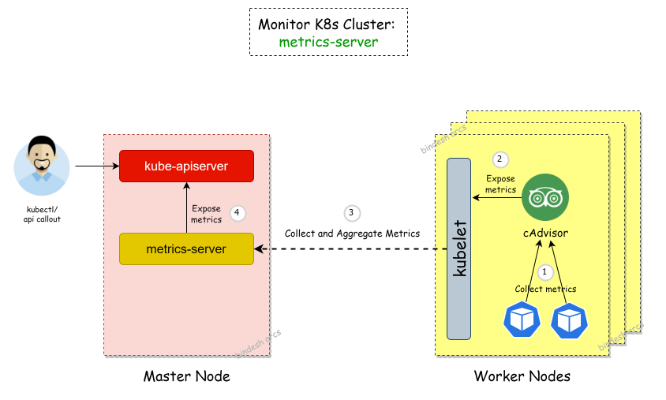

# Monitoring Kubernetes cluster (Kubeadm) with metrics-server



## Consideration

- We have Kubeadm cluster with one master node and atleast one worker node in ready state. To check, run "kubectl get nodes" command

### Step-01: Install the metrics-server on master node

Clone the metrics server from below GitHub repository and create a deployment.
(https://github.com/kubernetes-sigs/metrics-server/releases/tag/v0.3.7)

```kubectl apply -f https://github.com/kubernetes-sigs/metrics-server/releases/download/v0.3.7/components.yaml```

### Step-02: Edit the metrics-server Deployment manifest file

```kubectl edit deployment.apps metrics-server -n kube-system```


## Resources

- Kubeadm [Installation](https://kubernetes.io/docs/setup/production-environment/tools/kubeadm/install-kubeadm/)
- Docker [Installation](https://docs.docker.com/engine/install/#server)
- Weaver [Installation](https://www.weave.works/docs/net/latest/kubernetes/kube-addon/)
- CKA Exam [Curriculum](https://github.com/cncf/curriculum)


